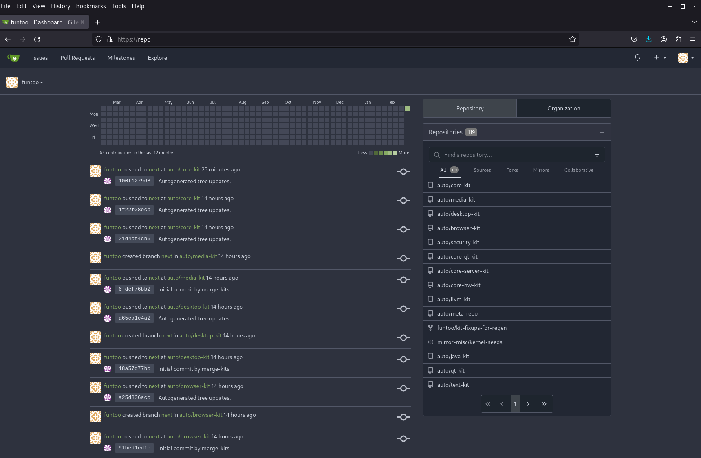
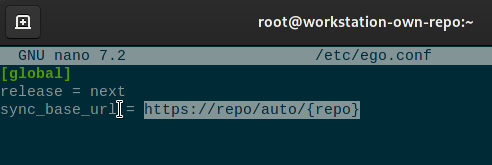

# Achtung! 
Use at your own risk!

# What is all about?
This ansible playbook will help you to create a local Funtoo Linux infrastructure setup.
With this setup you will be able
- to create your own locally built Funtoo Linux tar images with the power of [Funtoo Metro Project](https://www.funtoo.org/Funtoo:Metro)
- to create your own local Funtoo Linux meta repo with the power of [Funtoo Metatools Project](https://www.funtoo.org/Funtoo:Metatools)
- to serve your own local Funtoo Linux meta repo to your Funtoo Linux based installations with the power of [Gitea](https://about.gitea.com/)

# Requirements
- Ansible available on your controller host 
- a target host running Funtoo Linux
- ssh access on the target host from your controller host as root
- personal application token for github.com
- personal application token for gitlab.com
- personal application token for gitlab.freedesktop.org

# Configuration
In the file `production` under `[lxd]` you can configure the hostname of the target host where a lxd service will be installed and configured.

In the file `group_vars/lxd.yml` you can configure the download url of a lxd image for lxd container launching.

In the file `group_vars/regen.yml` you have to configure
- your username and personal application token for github.com
- your personal application token for gitlab.com
- your personal application token for gitlab.freedesktop.org

These credentials are needed due to anonymous access rate limiting on github.com, gitlab.com and  gitlab.freedesktop.org sites

# Run
```
ansible-playbook -i production site.yml
```
**Achtung!** The playbook generates a password for gitea application user and prints it out. WWatch it out as you will need it for log in the gitea application running on the lxd repo-container.    


# How to use the result setup
After the execution of this ansible playbook you will have 3 running lxd container on your lxd host
```
borisp@funtoo-lxd ~ $ lxc list
To start your first container, try: lxc launch ubuntu:22.04
Or for a virtual machine: lxc launch ubuntu:22.04 --vm

+-----------------+---------+-----------------------+------+-----------+-----------+
|      NAME       |  STATE  |         IPV4          | IPV6 |   TYPE    | SNAPSHOTS |
+-----------------+---------+-----------------------+------+-----------+-----------+
| metro-container | RUNNING | 192.168.110.10 (eth0) |      | CONTAINER | 0         |
+-----------------+---------+-----------------------+------+-----------+-----------+
| regen-container | RUNNING | 192.168.110.11 (eth0) |      | CONTAINER | 0         |
+-----------------+---------+-----------------------+------+-----------+-----------+
| repo-container  | RUNNING | 192.168.110.12 (eth0) |      | CONTAINER | 0         |
+-----------------+---------+-----------------------+------+-----------+-----------+
```
# Funtoo Metro
To create your own Funtoo Linux tar images just login into the `metro-container`
```
borisp@funtoo-lxd ~ $ lxc shell metro-container
metro-container ~ # 
```

Configure you preferred release, architecture and sub-architecture with menu based setup 
```
metro-container ~ # metro/scripts/setup
```
```
www.funtoo.org / funtoo

   1. 1.4-release-std
   2. next
```
```
www.funtoo.org / funtoo / next

   1. arm-64bit
   2. riscv-64bit
   3. x86-64bit
```
```
www.funtoo.org / funtoo / next / x86-64bit

   1. amd64-bulldozer
   2. amd64-excavator
   3. amd64-k10
   4. amd64-piledriver
   5. amd64-steamroller
   6. amd64-zen
   7. amd64-zen2
   8. amd64-zen3
   9. core2_64
  10. generic_64
  11. intel64-broadwell
  12. intel64-haswell
  13. intel64-ivybridge
  14. intel64-nehalem
  15. intel64-sandybridge
  16. intel64-silvermont
  17. intel64-skylake
  18. intel64-westmere
```
```
Created file /home/mirror/funtoo/next/x86-64bit/intel64-skylake/.control/strategy/build with contents 'local'
Created file /home/mirror/funtoo/next/x86-64bit/intel64-skylake/.control/strategy/seed with contents 'stage3'
Created file /home/mirror/funtoo/next/x86-64bit/intel64-skylake/.control/version/stage3 with contents '2023-11-21'
--2024-02-21 19:16:34--  https://build.funtoo.org/next/x86-64bit/intel64-skylake/2023-11-21/stage3-intel64-skylake-next-2023-11-21.tar.xz
Resolving build.funtoo.org... 121.127.45.81, 2a02:6ea0:f700::2
Connecting to build.funtoo.org|121.127.45.81|:443... connected.
HTTP request sent, awaiting response... 200 OK
Length: 597648172 (570M) [application/octet-stream]
Saving to: ‘/home/mirror/funtoo/next/x86-64bit/intel64-skylake/2023-11-21/stage3-intel64-skylake-next-2023-11-21.tar.xz’

/home/mirror/funtoo/next/x86-64bit/intel64-skylake/2023-11-21/stage3-i 100%[==========================================================================================================================================================================>] 569.96M  25.8MB/s    in 23s     

2024-02-21 19:16:57 (24.9 MB/s) - ‘/home/mirror/funtoo/next/x86-64bit/intel64-skylake/2023-11-21/stage3-intel64-skylake-next-2023-11-21.tar.xz’ saved [597648172/597648172]


Metro build for release next, x86-64bit, intel64-skylake has been initialized.
To build a new release, use ezbuild (or set up buildbot):
		
scripts/ezbuild.sh next x86-64bit intel64-skylake freshen+gnome
metro-container ~ # 

```

To start the creation of Funtoo Linux tar images just trigger the `metro/scripts/ezbuild.sh` with desired configuration. 
```
metro-container ~ # metro/scripts/ezbuild.sh next x86-64bit intel64-skylake freshen+lxd+kde
```
More info under https://www.funtoo.org/Funtoo:Metro/Initial_Setup 

On the metro-container running nginx server gives you a browser access to logs and created images. 


# Funtoo Meta-Repo Regeneration
To create your own local Funtoo Linux meta repo 
```
borisp@funtoo-lxd ~ $ lxc shell regen-container
regen-container ~ # 
```
Switch to the tree regeneration user
```
regen-container ~ # su --login tree
tree@regen-container ~ $ 
```
and trigger the tree regeneration process
```
tree@regen-container ~ $ time merge-kits next --prod --create_branches --fixups_branch own-repo-gitea --fixups_url=https://code.funtoo.org/bitbucket/scm/~borisp/kit-fixups.git
```
**Achtung!** Here we are using `--prod` and a forked repo of the [Funtoo official kit-fixups repo](https://code.funtoo.org/bitbucket/projects/CORE/repos/kit-fixups/) as at the moment I've found only one possibility to define the push target for merge-kits application - to overwrite the prod and mirror urls in the [releases/next/repositories.yaml](https://code.funtoo.org/bitbucket/users/borisp/repos/kit-fixups/browse/releases/next/repositories.yaml?at=refs%2Fheads%2Fown-repo-gitea#69) 
 See too [FL-12095](https://bugs.funtoo.org/browse/FL-12095) 

# Gitea as Meta-Repo Service 
Gitea runs in the third created lxd container `repo-container`. Please use the username `funtoo` and the password previous generated by the ansible playbook.



After a `successful` tree regeneration round you can use the `https://repo-containser/funtoo/{repo}` as `sync_base_url` in other Funtoo Linux installations.

